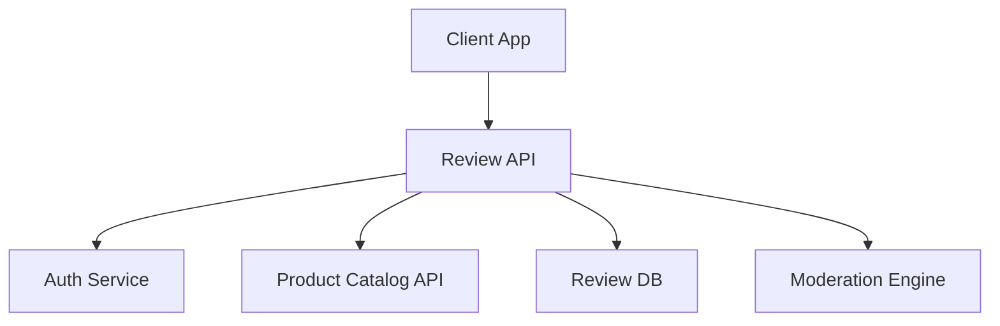

# Product Review API Documentation

## 1. Introduction

### Overview  
The **Product Review API** allows users to write, read, update, and delete reviews and ratings for products on an e-commerce platform. It supports essential features like moderation, rating aggregation, user verification, and review voting.

### Why It Matters  
Product reviews significantly influence buying decisions. A robust review system helps build trust, improve product discovery, and inform merchants and users about product quality and satisfaction.

### Who This Guide is For  
- Backend engineers implementing review functionality  
- Frontend developers creating product detail and review interfaces  
- QA and moderation teams managing user-generated content  
- Data analysts deriving insights from review trends  

---

## 2. Key Terminology

- **Review**: A written opinion about a product, often with a rating  
- **Rating**: A numeric value (usually 1–5 stars) indicating satisfaction  
- **Verified Purchase**: Indicates that the reviewer bought the product  
- **Moderation Status**: Indicates if a review is pending, approved, or rejected  
- **Helpful Vote**: Users can vote a review as helpful or not  
- **Review ID**: Unique identifier for a specific review  

---

## 3. Technical Overview

### Architecture Overview

Review API: Handles review CRUD and voting actions

Auth Service: Ensures only verified users can review

Product Catalog API: Ensures product validity

Review DB: Stores review content and metadata

Moderation Engine: Filters inappropriate content

4. Step-by-Step Guide or Workflow
4.1 Submit a Review
http
Copy
Edit
POST /api/reviews
Request:

json
Copy
Edit
{
  "product_id": "PROD123",
  "rating": 4,
  "title": "Great quality!",
  "content": "The build quality is excellent for the price."
}
Response:

json
Copy
Edit
{
  "message": "Review submitted and pending moderation.",
  "review_id": "REV1001"
}
4.2 Get All Reviews for a Product
http
Copy
Edit
GET /api/reviews?product_id=PROD123&page=1&page_size=10
Response:

json
Copy
Edit
[
  {
    "review_id": "REV1001",
    "user": "Jane Doe",
    "rating": 4,
    "title": "Great quality!",
    "content": "The build quality is excellent for the price.",
    "verified_purchase": true,
    "helpful_count": 5,
    "created_at": "2025-06-25T13:00:00Z"
  },
  ...
]
4.3 Update a Review
http
Copy
Edit
PUT /api/reviews/REV1001
Request:

json
Copy
Edit
{
  "rating": 5,
  "title": "Updated: Even better!",
  "content": "After two weeks of use, it's performing great."
}
Response:

json
Copy
Edit
{
  "message": "Review updated successfully."
}
4.4 Delete a Review
http
Copy
Edit
DELETE /api/reviews/REV1001
Response:

json
Copy
Edit
{
  "message": "Review deleted successfully."
}
4.5 Mark Review as Helpful
http
Copy
Edit
POST /api/reviews/REV1001/vote
Request:

json
Copy
Edit
{
  "helpful": true
}
Response:

json
Copy
Edit
{
  "message": "Vote recorded."
}
4.6 Aggregate Product Ratings
http
Copy
Edit
GET /api/reviews/summary?product_id=PROD123
Response:

json
Copy
Edit
{
  "average_rating": 4.3,
  "total_reviews": 127,
  "rating_breakdown": {
    "5": 72,
    "4": 33,
    "3": 10,
    "2": 7,
    "1": 5
  }
}
5. Best Practices
Restrict to Verified Purchases: Allow only users who bought the product to review

Prevent Spam: Use rate-limiting and moderation filters

Profanity Filters: Scan and flag inappropriate content

Pagination & Caching: Optimize review list queries

Highlight Verified Reviews: Increase trust and visibility

Allow Review Editing: Let users update their feedback

Notify Sellers: Alert when new reviews are posted

6. Common Issues & Troubleshooting
Issue	Cause	Solution
Duplicate review	User submits multiple reviews for the same product	Enforce one review per product per user
Profanity/inappropriate content	Unfiltered user input	Use moderation engine or third-party services
Performance lag	Uncached aggregate queries	Use Redis or query optimization
Unverified user	Not logged in	Require JWT or session token
Missing product ID	Invalid or null request	Validate input before DB call

7. References
OpenAI Moderation API

ElasticSearch for Full-Text Review Search

JWT Auth Best Practices

Google's Review Guidelines

8. Appendix
Sample Review Table Schema
Field	Type	Description
review_id	UUID	Unique review ID
user_id	UUID	ID of the reviewing user
product_id	UUID	Product being reviewed
rating	INTEGER	Rating between 1 to 5
title	TEXT	Short summary of review
content	TEXT	Main review body
verified_purchase	BOOLEAN	Whether user actually bought item
helpful_count	INTEGER	Number of helpful votes
moderation_status	STRING	pending, approved, or rejected
created_at	TIMESTAMP	Date review was created

Mermaid Diagram: Review Submission Flow
mermaid
Copy
Edit
sequenceDiagram
    participant User
    participant ClientApp
    participant ReviewAPI
    participant AuthService
    participant ProductService
    participant ModerationService
    participant DB

    User->>ClientApp: Submit review
    ClientApp->>ReviewAPI: POST /api/reviews
    ReviewAPI->>AuthService: Validate token
    ReviewAPI->>ProductService: Check product exists
    ReviewAPI->>ModerationService: Scan content
    ModerationService-->>ReviewAPI: Approve/flag
    ReviewAPI->>DB: Save review
    ReviewAPI-->>ClientApp: Return confirmation
Curl Example: Submit a Review
bash
Copy
Edit
curl -X POST https://api.example.com/api/reviews \
  -H "Authorization: Bearer <user_token>" \
  -H "Content-Type: application/json" \
  -d '{
        "product_id": "PROD123",
        "rating": 4,
        "title": "Good quality",
        "content": "Surprised by the quality for this price point."
      }'
API Response Standard
All endpoints should respond in this format:

json
Copy
Edit
{
  "status": "success" | "error",
  "message": "Descriptive message",
  "data": { ... }
}
